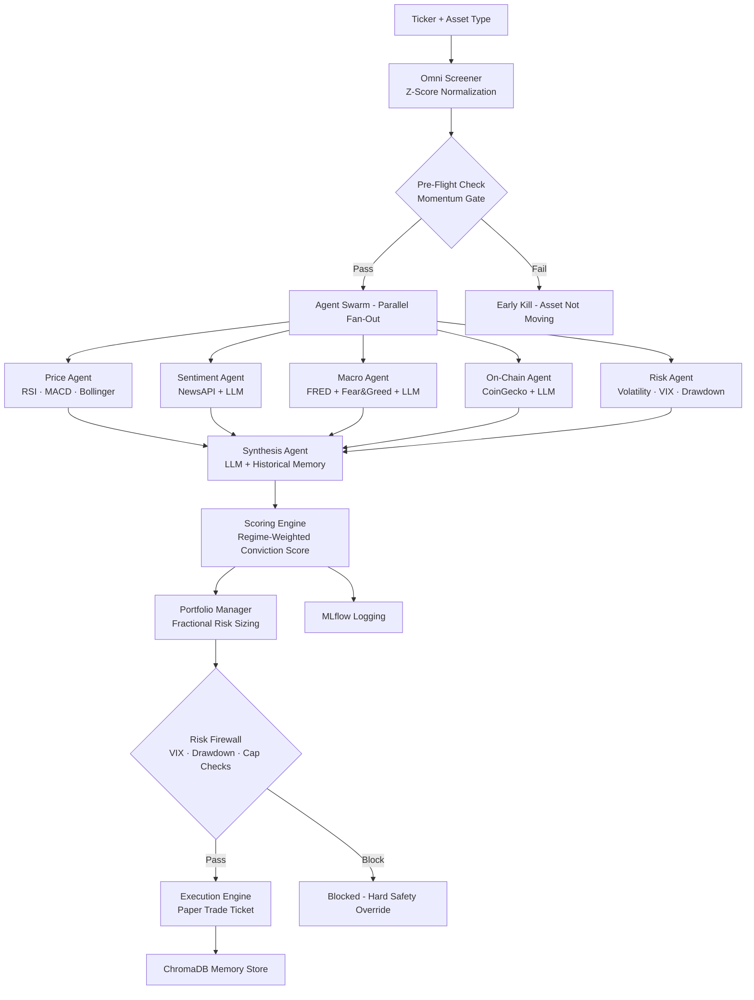

# MarketMind 🧠📈

**Multi-agent AI trading analysis engine.**  
Combines deterministic quantitative math with LLM agents to analyze global assets, score conviction, and generate structured trade tickets.

> ⚠️ **Disclaimer:** MarketMind is an analysis and research tool. It operates in paper trading simulation only. It does not execute real trades. Algorithmic trading carries significant financial risk. This software is for educational and research purposes.

---

## Architecture: The Great Divide

The core design principle is a strict separation between what math should do and what AI should do.

```
┌─────────────────────────────────────────────────────────────────────┐
│                        THE GREAT DIVIDE                             │
│                                                                     │
│   QUANTITATIVE PILLAR              QUALITATIVE PILLAR               │
│   (Deterministic Math)             (LLM Reasoning)                  │
│                                                                     │
│   Price Agent                      Sentiment Agent                  │
│   · RSI, MACD, Bollinger           · NewsAPI headlines              │
│   · Pure pandas/numpy              · Groq Llama 3.3 70B             │
│                                                                     │
│   Risk Agent                       Macro Agent                      │
│   · Annualized volatility          · FRED treasury yields           │
│   · Max drawdown, VIX              · Fear & Greed index             │
│   · Pure numpy                     · Groq Llama 3.3 70B             │
│                                                                     │
│                                    On-Chain Agent                   │
│                                    · CoinGecko market data          │
│                                    · Groq Llama 3.3 70B             │
└─────────────────────────────────────────────────────────────────────┘
```

**Why this matters:** LLMs hallucinate support/resistance levels. They are unreliable for anything that has a mathematically correct answer. But they excel at reading unstructured text — news headlines, earnings call language, macroeconomic narratives. The Great Divide puts each tool where it belongs.

---

## Full Pipeline



---

## Tech Stack

| Layer | Technology | Why |
|---|---|---|
| Agent Orchestration | LangGraph 1.1.9 | Native parallel fan-out, stateful graph, operator.add reducers |
| LLM Provider | Groq (Llama 3.3 70B) | Sub-second inference — critical for parallel agent latency |
| Market Data | yfinance, CoinGecko | Free, reliable, covers equities/crypto/forex/commodities |
| Macro Data | FRED API | Official Federal Reserve data — no revisions on yield series |
| News Data | NewsAPI | 10 headlines per run, real-time |
| API Layer | FastAPI + Uvicorn | Async, auto-docs at /docs, production-grade |
| GUI | Streamlit | Rapid demo UI, no frontend code required |
| Observability | MLflow | Every run logged with inputs, signals, scores, timing |
| Memory | ChromaDB | Vector similarity search for historical context retrieval |

---

## Setup

### 1. Clone and install

```bash
git clone https://github.com/your-username/marketmind
cd marketmind
uv sync
```

### 2. Configure environment variables

```bash
cp .env.example .env
```

Edit `.env`:

```env
# Required
GROQ_API_KEY=your_groq_api_key        # https://console.groq.com
NEWS_API_KEY=your_newsapi_key          # https://newsapi.org
FRED_API_KEY=your_fred_api_key         # https://fred.stlouisfed.org/docs/api/api_key.html

# Optional (for live execution — not yet implemented)
ALPACA_API_KEY=your_alpaca_key
ALPACA_SECRET_KEY=your_alpaca_secret
```

### 3. Run

**CLI — single ticker:**
```bash
python main.py --ticker AAPL --type equities
python main.py --ticker BTC-USD --type crypto
python main.py --ticker EURUSD=X --type forex
```

**API backend:**
```bash
uvicorn api:app --reload --port 8000
# Docs available at http://localhost:8000/docs
```

**Streamlit GUI:**
```bash
streamlit run app.py
# Opens at http://localhost:8501
```

**MLflow tracking dashboard:**
```bash
mlflow ui --port 5000
# Opens at http://localhost:5000
```

---

## Sample Output

```
============================================================
  🧠 MarketMind Analysis: AAPL (equities)
============================================================

📚 Retrieving historical memory... No prior memory for AAPL — first run
📊 MLflow run started: a3f7c2d1...
🚀 Deploying agent swarm...

============================================================
  📋 ANALYSIS RESULTS
============================================================

🤖 Agent Swarm:
   🟢 PRICE        BULLISH  (82% confidence) — Fresh MACD crossover with RSI at 58 suggests strong momentum.
   🟢 SENTIMENT    BULLISH  (75% confidence) — Coverage dominated by iPhone cycle optimism and buyback announcements.
   🟡 MACRO        NEUTRAL  (60% confidence) — Treasury yields stable; Fear & Greed at 62 indicates mild greed.
   🟢 ONCHAIN      NEUTRAL  (50% confidence) — N/A: Not a crypto asset.
   🟢 RISK         BULLISH  (78% confidence) — Annualized volatility 24%, VIX 14.2 — calm risk environment.

📊 Regime: LOW_VOLATILITY_BULL
   Conviction Score: +0.68  [>>>>>>>>>>>>>>       ]

🟢 FINAL VERDICT: BUY (81% confidence)
   Strong technical momentum, positive sentiment, and a calm risk environment
   align in a low-volatility bull regime. Macro is neutral but not a headwind.

💼 Trade Ticket:
   Action:   BUY
   Size:     $2,040.00
   Firewall: ✅ PASSED

⏱️  Completed in 14.3s
============================================================
```

---

## API Reference

### `POST /analyze`

```json
{
  "ticker": "AAPL",
  "asset_type": "equities",
  "account_size": 100000.0
}
```

Response includes: `agent_signals`, `final_verdict`, `conviction_score`, `market_regime`, `proposed_trade`, `firewall_passed`, `run_duration_seconds`.

### `GET /health`

Returns API status, ChromaDB memory stats, MLflow URL.

### `GET /history/{ticker}`

Returns past analyses stored in ChromaDB for a given ticker.

---

## Roadmap

| Status | Feature |
|---|---|
| ✅ Complete | Multi-agent LangGraph orchestration |
| ✅ Complete | Parallel fan-out with operator.add reducer |
| ✅ Complete | Quantitative price + risk math engines |
| ✅ Complete | LLM agents (sentiment, macro, on-chain, synthesis) |
| ✅ Complete | Regime-weighted conviction scoring |
| ✅ Complete | Risk firewall (VIX override, drawdown halt, cap check) |
| ✅ Complete | FastAPI layer with async execution |
| ✅ Complete | Streamlit GUI |
| ✅ Complete | MLflow experiment tracking |
| ✅ Complete | ChromaDB episodic memory |
| 🔲 Phase 2 | Alpaca paper trading integration |
| 🔲 Phase 2 | Quant-only backtester (price + risk agents, point-in-time data) |
| 🔲 Phase 2 | ATR-based position sizing to replace fractional risk |
| 🔲 Phase 3 | Sentiment proxy backtesting (VIX + put/call + momentum) |
| 🔲 Phase 3 | Performance analytics dashboard (Sharpe, Calmar, win rate) |
